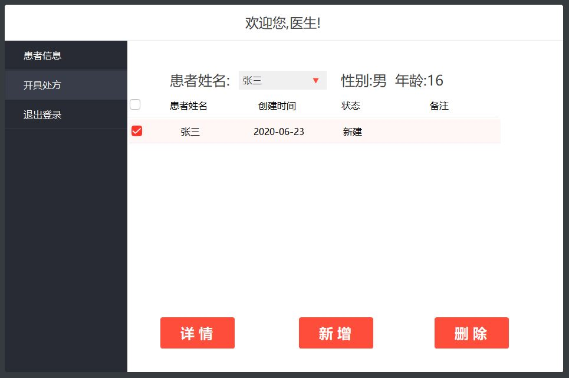

# HIS.LITE

## 一个学习项目

利用半天时间，使用**VB.NET**编写的一个**Winform**学习项目，医院信息管理系统

用的*IDE*是**Visual Studio 2010 Express**，数据库是**SQL Server 2008**

使用了**[NetWinformControl](https://github.com/kwwwvagaa/NetWinformControl)**控件作为程序的主要控件，*Clone*或者*Download*到本地之后，直接就可以编译并运行了，考虑到有的*Visual Studio*版本不支持*Nuget*，这里把引用的*DLL*也上传了，不用担心

## 为什么要传上来

因为当今很多学校的教学课程相对主流技术栈比较滞后，课程上老师要求用的*IDE*以及语言都是脱离主流的，实际了解到还有很多的学校在教学，以及作业中，都是要求同学们用一些比较老的技术栈来进行开发，这里上传这个项目，给大家一个用这些东西开发一个可以与数据库交互的小型程序的参考

项目中除了控件，没有用到其它非官方*DLL*，另外因为是用的*.NET Framework 4*，也无需在乎运行环境的问题，总的来说，可以为同学们只用课程相关的内容来进行开发提供思路与参考，可以通过这个小项目学到的除了Winform基础知识之外，还有使用ADO.NET与数据库进行交互，VB.NET中Lambda表达式的写法等

## 功能预览

## License 许可证

HIS.LITE is licensed under [MIT](https://github.com/xukimseven/HardCandy-Jekyll/blob/master/LICENSE).